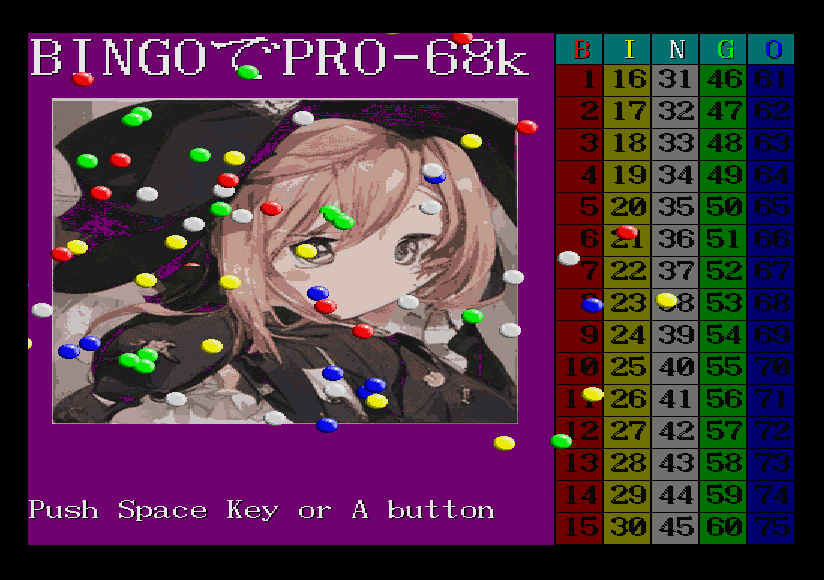
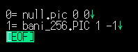
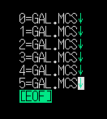
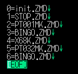
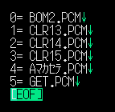

# 「BINGOでPRO-68k」  
-X68000-GAME-　ビンゴマシン  

## 概要  
忘年会、新年会、パーティーなどで盛り上がるゲームといえば、BINGO！！  
X68000 Zのコンパクトさを活かして、様々なシーンで活躍できること間違いなし！  
パーティーで目立っちゃおう！！  

## 特徴
* 1～75番までランダムで番号を抽選します。
* 演出として、１回につき、３つの数字を選出しますが、抽選されるのは１つです。
* 抽選された番号の履歴を表示します。
* 過去１０球分の抽選履歴順を表示します。
* 画像、動画、音楽、効果音のデータを差し替えてオリジナルのビンゴマシンを作ることができます。

## プログラムの流れ
* 入力する→３球選出する→動画再生→１球だけ抽選する　をボールが無くなるまで繰り返します。

## 起動方法  
* FDD起動の場合：XDFイメージをドライブ0に挿入しOPT.1キーを押しながら起動してください。
* HDD起動の場合：BINGOフォルダごとHDD等に保存した場合、START.BATを実行してください。 

## 終了方法
* ESCキーを長押し

## リセット方法
* HELPキーを長押し（Game Over）

## 操作方法  
* キーボード　　　　：SPACEキー
* ジョイスティック１：Aボタン

## データ差し替え方法  
### 画像（data/cg/g_list.txt）

|項目|詳細|備考|
|:------|:-----:|:------|
|フォーマット  |PIC      |    |
|色数          |256色    |プログラム内で１６色に減色しています|
|サイズ        |312 x 328|※サイズの範囲内でお願いします。    |

※ファイルはリストファイルと同じ場所に置いてください。
※PICファイル作成方法は後日記載予定 

同フォルダにある「g_list.txt」を編集して画像を登録ください。  

|番号   |使用される箇所    |第一引数|第二引数|備考   |
|:------|:------:|:------:|:------:|:------|
|0      |(予約)             |0     |0   |本行は変更しないでください|
|1      |タイトル＆ゲーム中 |1     |-1  |第一引数と第二引数は変更しないでください |

※減色に成功すれば下記ファイルが生成されます。  
　画像を差し替えた場合は、下記ファイルの削除をお願いします。  
OK_tmp_G01.G16  
OK_tmp_G01.P16  

### 動画（data/mov/mov_list.txt）

|項目|詳細|制約事項|
|:------|:-----:|:------|
|フォーマット  |MACS      |ファイルVer1.14まで   |

※ファイルはリストファイルと同じ場所に置いてください。

同フォルダにある「g_list.txt」を編集して画像を登録ください。  

|番号   |使用される箇所    |備考   |
|:------|:------:|:------|
|0      |抽選前にランダムで再生 | 透過色あり|
|1      |抽選前にランダムで再生 | 透過色あり|
|2      |抽選前にランダムで再生 | 透過色あり|
|3      |抽選前にランダムで再生 | |
|4      |抽選前にランダムで再生 | |
|5      |抽選前にランダムで再生 | |

### 音楽（data/music/m_list.txt）

|項目|詳細|制約事項|
|:------|:-----:|:------|
|フォーマット  |ZMD      |Z-MUSIC Ver2.xで再生できるもの|

※ファイルはリストファイルと同じ場所に置いてください。

同フォルダにある「g_list.txt」を編集して画像を登録ください。  

|番号   |使用される箇所    |備考   |
|:------|:------:|:------|
|0      |(予約)             |本行は変更しないでください|
|1      |(予約)             |本行は変更しないでください|
|2      |タイトル画面で再生 | |
|3      |初期化中に再生 | |
|4      |抽選前に再生 | |
|5      |抽選中に再生 | |
|6      |BINGO終了時に再生 | |

### 効果音（data/se/p_list.txt）

|項目|詳細|制約事項|
|:------|:-----:|:------|
|フォーマット  |ADPCM      |サンプリング周波数は15.625kHzのデータ   |

※ファイルはリストファイルと同じ場所に置いてください。

同フォルダにある「g_list.txt」を編集して画像を登録ください。  

|番号   |使用される箇所    |備考   |
|:------|:------:|:------|
|0      |対象外の番号で再生 | |
|1      |１球目で再生 | |
|2      |２球目で再生 | |
|3      |３球目で再生 | |
|4      |抽選後に再生 | |
|5      |ボタンを押した時に再生 | |

## 動作環境
* FLOAT2.X　または、その互換ドライバ  
* IOCS.X　または、その互換ドライバ  
* MACSDRV.X ver1.16のみ（新バージョンは使えません）
* MOON.X
* ZMUSIC.X ver2.08

## 履歴  
* 2023/11/	ver.0.9.1  
** 透過色のあるMACSデータ再生対応  
** 音楽の再生開始位置を調整  
** ボール同士の当たり判定見直し  
** LCDモード時のスプライトのズレ修正  
** リストファイルの「;」コメント対応  
** HELPキー長押しでリセット  
   
* 2023/11/5	ver.0.9.0  
** 初回リリース（という名の公開デバッグ）  
