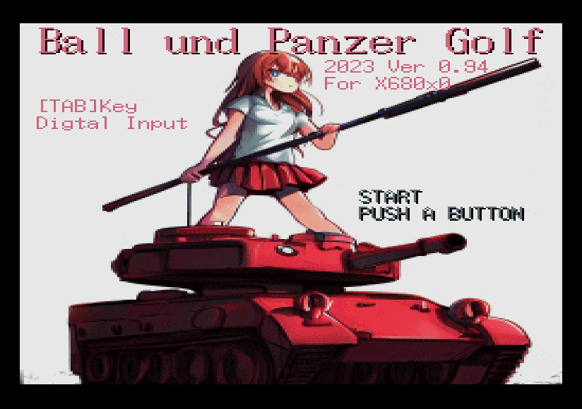

# 戦車でゴルフ「Ball und Panzer Golf」 
 

● 内容 
　X68000で動くゲームです。一人プレイ専用です。 
　戦車を操作してホールインワンを狙ってください。 
　18ホールの全ての旗を破壊したらクリアです。 
　ゴルフ同様、スコアを競って遊んでください。 

● 操作方法 
　アナログ操作（サイバースティック対応） 
　　戦車の向き			：右レバー 
　　戦車の移動			：左スロットル 
　　ショット			：Aボタン（右レバーにあるボタン） 
　　ボールを落下させる	：ショット後、Aボタン 

　デジタル操作（ジョイカード、ジョイスティック、キーボード） 
　　戦車の向き			：左、右 
　　戦車の移動			：上、下 
　　ショット			：Aボタン 
　　ボールを落下させる	：ショット後、Aボタン 

　キーボード操作 
　　戦車の向き			：←、→、４、６ 
　　戦車の移動			：↑、↓、８、２ 
　　ショット			：Ｚ 
　　ボールを落下させる	：ショット後、Ｚ 

  入力切替				：TABキー 
  終了					：ESCキー 

● ルール 
　ステージクリア条件：旗を全て破壊すること 
　ゲームオーバー条件：持っているボールが全てなくなること 

　「ショットするフェーズ」「移動するフェーズ」があります。 　

　最初はゴルフ同様「ショットするフェーズ」です。 
　戦車をいい感じの方向に回転した後、旗に目掛けてボールを「ショット」してください。 
　一度「ショット」しただけでは、ボールは上昇していくだけなので 
　適度なポイントで「ボールを落下させる」でボールを落としてください。 
　上手く旗にボールを当てることができたら、旗を破壊することができます。 
　また、「ショットするフェーズ」中は水色のエリア内だけ移動可能です。 
　水色のエリア内に存在する旗をゲットすればボールが１つ増えます。 

　旗を破壊したら「移動フェーズ」に変わります。 
　戦車を操作して、破壊した旗から出てくる「エネルギー」を回収してください。 
　「エネルギー」を回収すると「ショットするフェーズ」に変わります。 

　色々なポイントでハイスコアにつながる要素があるので、発見しながら楽しんでください。 

やることリスト  
## ゲーム
* ~~終了時の画面モードがゲームのまま~~

## グラフィック
* ~~0番パレットがゴミ~~

## スプライト
* XSPを使わないスプライト管理システムの実装

## BGM
* マニュアルに出所を書く  

## SE
* ~~音量を一定にしたい。サンプリングレートも~~

## MACS
* ~~なぜか再生するとフリーズするので、改善したい~~

## 白窓君
* コンボ数を表示するとか

---
