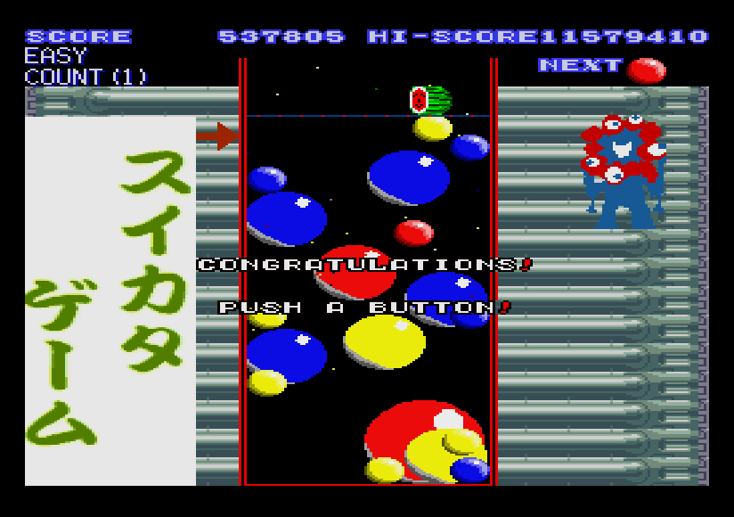

# 「スイカタゲーム」  -X68000-GAME-  
 

## 概要  
某ゲームに憧れて作ってみました。  
同じ色、同じサイズ同士のボールをくっつけて、大きくしよう！

## 特徴
独特な積み上がり方をします。  
次々にボールを落とすことが出来るので、連鎖を狙うことができます。  

## ゲームの流れ  
ひたすら同じ大きさの同じ色のボールをくっつけて大きくしてください。  
ボールのサイズは４段階あります。  
最大サイズである４段階目のボール同士をくっつけるとお祝いメッセージと100万点ボーナスをゲットできます。  
その後、ボールが消えますので、ゲームに終わりはありません。  

## 起動方法  
* FDD起動の場合：XDFイメージをドライブ0に挿入しOPT.1キーを押しながら起動してください。  
* HDD起動の場合：SUIKATAフォルダごとHDD等に保存し、SUIKATAフォルダ内のSTART.BATを実行してください。  

## 終了方法  
* ESCキーを長押し  

## 操作方法  
* ジョイスティック１  
移動  ：十字ボタン(Bボタン押しながらで倍速移動)  
落下  ：Aボタン  

* キーボード  
移動  ：カーソルキー(Xボタン押しながらで倍速移動)    
落下  ：SPACEキー or Zキー  

## やりなおし   (ver0.1.2)
* HELPキーを長押し
  
## レジューム機能（現状のボールの配置を保存）   (ver0.1.2)
* F6キーを長押し
  

## オリジナルのテーマを作ろう
１．dataディレクトリ内に存在する_default_ディレクトリを複製します。（例：複製したディレクトリ名をmoemoeとする）  
２．datalist.txtをエディタで開きます。  
　　　0= _default_  
　　　1= moemoe　　←　ここを追加しましょう。  
３．後は、moemoe内にあるデータを差し換えるだけです。  
４．ゲームの起動時にどのテーマを選択するか聞いてくるので、キーボードで数値を入力ください。（めんどくさ  

## デバッグ機能  
001～255までの数値をキーボードで入力し、当たり判定などを表示します。  
000で非表示です。  
各ビット毎に機能があります。  
0bit目 ステータス表示  
1bit目 移動中のスプライト表示  
2bit目 移動中のスプライトの当たり判定 表示  
3bit目 移動中のスプライトのサイズ 表示  
4bit目 加速度 表示  
5bit目 当たり判定 表示  
6bit目 合体時内部ステータスがMAXになる  
7bit目 衝突判定 表示   (ver0.1.2)

## 動作環境
* X68000 24MHz以上推奨  
* メモリ6MB以上(うぉい！)  
* FLOAT2.X　または、その互換ドライバ  
* IOCS.X　または、その互換ドライバ  
* PCM8A.X  
* ZMUSIC.X ver2.08  

## ダウンロード  
[[Download]](https://github.com/kata68k/X68000/blob/master/Game/SuiKata/SUIKATA011.LZH)	ver0.1.1(2024/08/29)  

## やることリスト  
*  合体時のリアクションを追加したい。(ver0.1.2)  
*  巨大はボタンが押されるまで表示。その後、MACS動画再生か？  
*  スプライト情報とボールの情報が乖離しているので修正   (ver0.1.2)  
*  当たり判定を改善　SPサイズ＞合体範囲＞接触範囲 (ver0.1.2)  
*  天井に着いたボールがアンダーフローしてしまうので修正  
*  難易度が上昇する仕組み  
  

## 履歴  
* 2024/08/29	ver.0.1.1  
** ボールが枠外に出る現象 修正  
** 発射時に壁際だとボールがX移動してしまう 修正  
** 極大ボールが消えない 修正  
* 2024/08/28	ver.0.1.0  
** 当たり判定を座標式から配列式へ 変更  
** 極大ボール 4→2個 変更  
** 小ボール 32→48個 変更  
** スプライトの管理処理更新  
** デバッグ機能 追加
* 2024/06/07	ver.0.0.6  
** 回復仕様 修正(連鎖がリセットされるまで回復していた)  
** ボーダーライン判定 修正  
** 連鎖の間隔 修正  
* 2024/06/01	ver.0.0.5  
** 起動時のメニューが１つだけだと自動選択  
** 当たり判定 変更  
* 2024/05/15	ver.0.0.5x6  
** スプライト最大定義数変更  
** 当たり判定 変更  
** 合体後の座標 変更  
* 2024/05/12	ver.0.0.5x5  
** パレットの番号仕様変更  
** 当たり判定変更 
* 2024/05/11	ver.0.0.5x4  
** スプライトのアニメーション対応（自機と右側のキャラ）  
** パレットの番号変更 0がテキストなので1ズラした  
** 当たり判定変更 めり込みは無くなったが簡単に消しやすくなった…  
** テキスト描画処理 変更  
** スコア表示修正  
* 2024/05/7	ver.0.0.5x3  
** SP任意の矩形サイズできるように修正  
* 2024/05/2	ver.0.0.5x2  
** SP任意の矩形サイズ 対応  
* 2024/04/28	ver.0.0.5x1  
** SEリスト修正  
** ファイルリスト読み出し処理 修正  
** 連鎖の猶予時間を伸ばした  
** 連鎖が10以上でSEが停止していたのを修正  
** ファイルリスト読み込みでエラーとなる箇所を修正  
** レベルメーターの挙動を修正  
** スプライトデータの読み込み仕様を変更  
** 最終サイズ同士をくっつけると、スペシャルボーナスが発生し、ボールは消えるように変更  
** フィールドサイズを少し小さく変更  
* 2024/04/27	ver.0.0.4  
** タイトル画面 追加  
** デモ 追加  
** ゲームクリア？達成条件成立でメッセージ表示とボーナス 追加  
** BGMリスト 見直し  
** BGMとSE 変更  
** ZPD 改良 
** 自機スプライトの数(１個→２個) 変更  
** ボールの当たり判定 見直し
* 2024/03/03	ver.0.0.3  
** ZPD対応  
** XSP 支援 PCM8A 割り込みマスクパッチ当て関数ライブラリ対応  
** 自前の垂直同期割り込み、ラスタ割り込みの処理修正
* 2024/03/01	ver.0.0.2a  
** タイトル処理部分修正  
** 画像を一部修正  
* 2024/02/25	ver.0.0.2  
** テーマを起動時に変更できるようにした。（datalist.txt）  
** スプライトの管理方法を変更した。(data/sp/*.SP *.PAL)  
** BGを使うようにした。(data/sp/BG.SP)  
** スコア機能を追加しました。(SUIKA.X)  
** ボールの積み上げ方を修正した。(SUIKA.X)  
* 2023/11/25	ver.0.0.1  
** 初回リリース（という名の公開デバッグ）  
