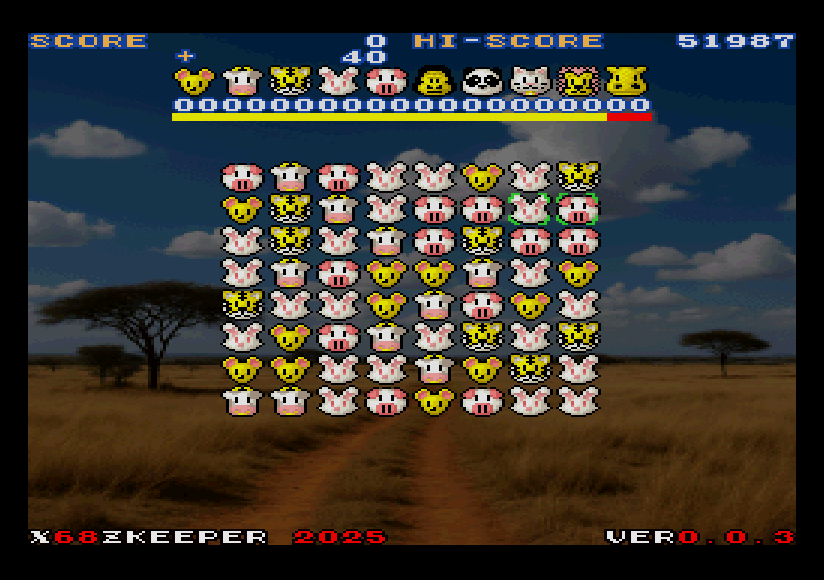

# 「X68ZKeeper(えっくすろくはちぜっときーぱー)」  -X68000-GAME-  
 

## 概要  
好きなゲームを記憶だけで作ってみました。  

## 特徴  
連鎖、削除対象チェック機能、練習モード、カットインによる演出有り  
データを差し換えてオリジナルのテーマを作ろう！  

## ゲームの流れ  
縦か横に３つ以上同じ絵柄を並べて消そう！  
一定以上消すと新しい絵柄が出現するよ！  
タイムオーバーでゲーム終了！  
素早く消しに消しまくって高得点を狙おう！  

## 起動方法  
* FDD起動の場合：XDFイメージをドライブ0に挿入しOPT.1キーを押しながら起動してください。  
* HDD起動の場合：X68ZKeeperフォルダごとHDD等に保存し、X68ZKeeperフォルダ内のSTART.BATを実行してください。  

## 終了方法  
* ESCキーを長押し  

## 操作方法  
* ジョイスティック１  
十字ボタン  ：カーソル移動  
Aボタン     ：カーソルで選択された絵柄の交換  
Bボタン     ：カーソルを縦方向もしくは横方向に切り替え  

* キーボード  
カーソルキー       ：カーソル移動  
SPACEキー or Zキー ：カーソルで選択された絵柄の交換  
Xキー              ：カーソルを縦方向もしくは横方向に切り替え  

## 練習モード  
メニュー or Qキー	：消してもレベルアップしない。タイマー動かない。点数は加算されない永遠に遊べる機能。  

## MACS  
カットインの演出をMACS(アニメーション)で実現します  

## やりなおし  
HELPキー長押し  

## オリジナルのテーマを作ろう  
（工事中）

## デバッグ機能  
なし

## 動作環境
* X68000 XVI推奨  
* メモリ4MB以上  
* FLOAT2.X　または、その互換ドライバ  
* IOCS.X　または、その互換ドライバ  
* PCM8A.X  
* ZMUSIC.X ver2.08  

## ダウンロード  
https://github.com/kata68k/X68000/blob/master/Game/X68ZKeeper/  

## やることリスト  

## 開発環境  

## 謝辞  

## 履歴  
* 2025/06/25	ver.0.0.6  
** MACSの読み込み処理を拡張した  
** スプライトのパレットデータ割り当て修正 
* 2025/06/15	ver.0.0.5  
** メニュー機能追加 練習モード、練習モードのレベル、MACSのON/OFFが出来るようにした。  
** 画像データは240色までとする仕様変更  
** MACS対応 カットイン演出が出来るようになった。  
** 練習モードをメニューから好きなレベルで遊べるようにした  
* 2025/06/07	ver.0.0.4  
** 初期化の初期化でNoMoreMoveになってゲーム進行が止まる不具合 修正  
** スワップトリガーで初期化配置を設定してた方式をやめた  
** コンボカウンタのインクリメント 修正  
** スコア表示のレイヤー 変更  
* 2025/06/04	ver.0.0.3  
** 難易度が更新されず飽和してたので 修正  
** 練習モード 追加  
** やりなおし機能 追加  
** 消去時残りタイム２秒加算 追加  
* 2025/06/01	ver.0.0.2  
** ２回目以降のプレイで難易度の初期化漏れ 修正  
** スコア表示時にカーソルの消去漏れ 修正  
** ランキングネーム入力IF処理 見直し  
** ランキングネーム入力の効果音処理 見直し  
** 背景画像表示 追加  
** ZPDの読み込み処理 修正  
* 2025/05/28	ver.0.0.1  
** 初回リリース（という名の公開デバッグ）  
* 2025/05/11	ver.0.0.0  
** 開発スタート  
