# 拡張グラフィックモードで動画(MACSデータ)を作ってみよう！

MACSとは？
------------

#### MACSDRV.doc 引用

>MACSとはX680x0における'アニメーション'をもっと手軽に扱うために生まれた常駐型の
>アニメーションコントローラです。

#### MACSDRV Version 1.16の勝手に改造 引用
>概要  
>MACSに以下の画面/音声モードを追加します。（要HIMEM.SYS互換IOCS＋ハイメモリ）  
>  256x256 65536色  
>  256x256 256色  
>  384x256 256色  
>  512x512 16色  
>  512x512 4色  
>  768x512 1色  

>  PCM8++が対応するすべての形式  

## MACSデータ作成補助ツール（MACScnv.x)について
#### いきさつと目的
MACSデータは、プログラム(アセンブラ)＋画像データ＋音声データの組み合わせです。  
MACSデータ作りは大変なので、MACSデータ作成補助ツール（MACScnv.x)を作りました。  
#### 概要
本ツール(MACScnv.x)は、MACSデータを作るための補助ツールです。  
画像データと音声データを用意し、補助ツールが出力するバッチファイルを実行すれば、MACSデータが作れる仕組みになっています。  

------------
### 工程
MACSデータ作成には、下記の２工程があります。  

   1.***データ抽出 工程***  

Windows環境等で動画データから、画像データと音声データを抽出し、MACSデータの素材を準備します。  

   2.***データ加工 工程***  

| No.| バッチファイル名    | 概要                                |
|----|---------------------|-------------------------------------|
| 1  | 0_MakeTxTp.bat      | 画像処理  |
| 2  | 1_MakePCM.bat       | 音声データ変換  |
| 3  | 2_MakeLZE.bat       | 画像圧縮（Windowsで実行推奨）  |
| 4  | 3_MakeBLK.bat       | データオブジェクト生成  |
| 5  | 4_MakeMACS.bat      | アセンブル、リンク、MACSデータ作成  |

上記のようにMACSデータ作成補助ツール（MACScnv.x)が、５つのバッチファイルを生成するので、順番に実行してMACSデータを作ります。

### 必要な環境
WindowsとX68000間でデータのやり取りができること。
#### Windows ソフトウェア
| No.| ツール名            | 概要                                |
|----|---------------------|-------------------------------------|
| 1  | VideoProc Converter | 動画を画像データと音声データに分解(これができるならどのツールでもよい)  |
| 2  | IrfanView           | 複数の画像データを一括で加工できる  |

#### X68k ソフトウェア
| No.| ツール名         |Version | 概要                                |所在|
|----|------------------|--------|-------------------------------------|----|
| 1  | FLOATx.X         |        | 浮動小数点型(float)が扱える         |システムディスクに同梱|
| 2  | (V)TwentyOne.sys |        | 長いファイル名が扱える              |リンク参照|
| 3  | MACSDRV.x        |1.16+0.10.8 | 常駐型のアニメーションコントローラ  |X68K BBS|
| 4  | MakeMCS.x        |1.01    | MACSデータ生成                      |MACS116.LZHに同梱  |
| 5  | APICG.r          |2.11A   | 画像ローダー                        |リンク参照|
| 6  | gvrsave.x        |0.2.6   | 画像セーバー                        |リンク参照|
| 7  | lze.x            |        | データ圧縮                          |MACSDRV Version 1.16の勝手に改造に同梱|
| 8  | lze.exe          |        | データ圧縮(Windows用)               |MACSDRV Version 1.16の勝手に改造に同梱|
| 9  | 060high.x        |        | 画像ローダー＆セーバー              |リンク参照|
| 10 | HAS060.x         |3.09+89 | アセンブラ                          |リンク参照|
| 11 | hlk.r            |3.01+15 | リンカ                              |リンク参照|
| 12 | pcm3pcm.x        |2.15    | WAVからPCMへ変換する                |どこ？|
| 13 | MACScnv.x        |1.03    | MACSデータ作成補助                  |X68K BBS|

#### X68k ヘッダファイル
| No.| ファイル名       | 概要                |所在               |
|----|------------------|---------------------|-------------------|
| 1  | MACS_sch.h       | MACS用ヘッダファイル|MACSDRV Version 1.16の勝手に改造に同梱  |

#### X68k ハードウェア
本体：X68000+PhantomX(060モード）、X68030+060turbo、もしくは、エミュレータ XEiJ(060turbo)  
メモリ：ハイメモリ128MB以上（推奨）  
拡張ボード：まーきゅりーゆにっと（推奨）  
### リンク

- [システムディスク](http://retropc.net/x68000/software/sharp/human302/):Makoto KamadaさんのX68000 LIBRARYのページ
- [MACSDRV](http://retropc.net/x68000/software/movie/macs/macsmoon/):Makoto KamadaさんのX68000 LIBRARYのページ
- [(V)TwentyOne](http://gorry.haun.org/x68index.html):GORRYさんの「ポリバケツＸ」...X680x0のページ
- [APICG](http://gorry.haun.org/x68index.html):GORRYさんの「ポリバケツＸ」...X680x0のページ
- [HAS](http://http://retropc.net/x68000/software/develop/as/has/):Makoto KamadaさんのX68000 LIBRARYのページ
- [hlk](https://github.com/kg68k/hlk-ev/releases/):立花@桑島技研さんのGitHub

## 手順

---
### 1. 好きな動画ファイルを準備しよう！ 
VideoProc Converterの機能が便利です。 
体験版は、５分までの制約がありますが、X68000では扱いきれないサイズなので問題ありません。(笑)

---
### 2. VideoProc Converterで動画ファイルから画像データ(PNG)を出力しよう！ 
「ビデオ」を選択します。 
 
---
下のメニューから「スナップショット」を選択します。 
 
---
「画素数」を最大値になるように上げます。※直接入力ではなく、カーソルキー↑、PageUpがオススメ 
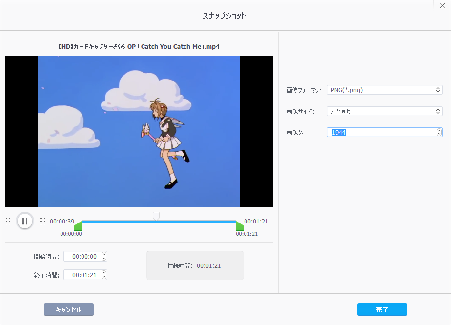 
---
右下の「出力フォルダ」で適当な場所を選択し、「RUN」を押して画像を抽出します。 
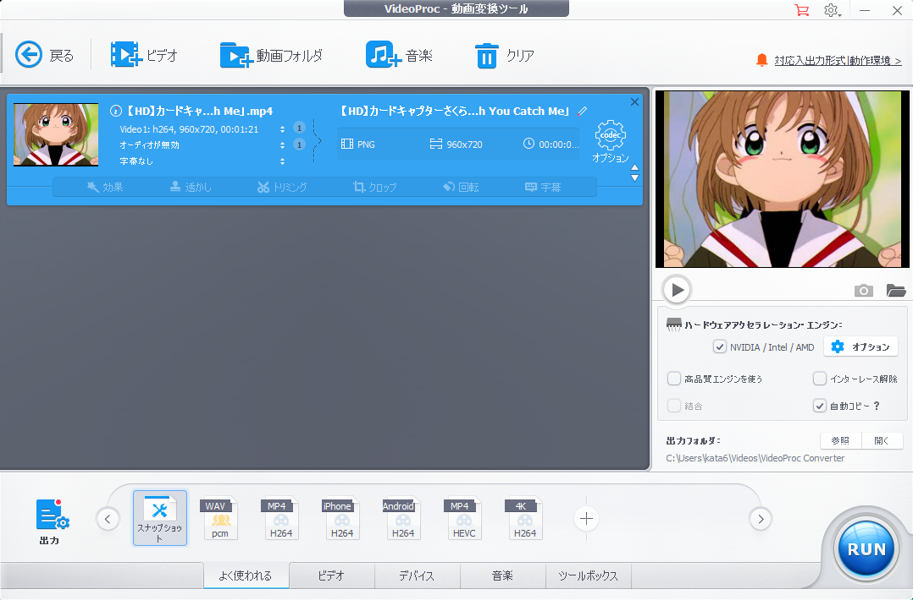 
---
PNGファイルが抽出されます。 
 

---
### 3. VideoProc Converterで動画ファイルから音声データ(WAV)を出力しよう！ 
下のメニューから「PCM」を選択します。 
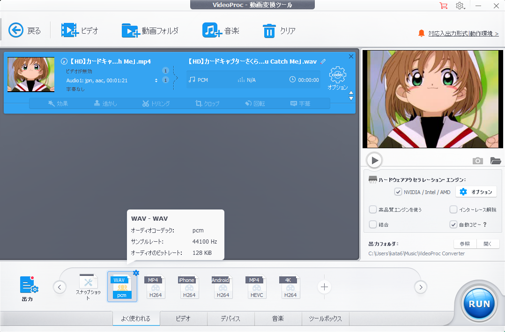 
---
オプションの変更は不要です。
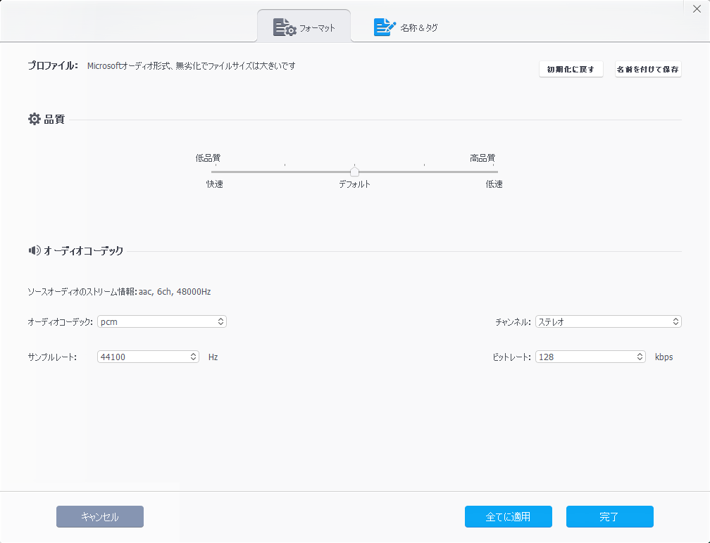 
---
WAVファイルが作成されるので、複製を作り「AD.WAV」にファイル名を変更ください。 
 

---
### 4. リサイズ＆減色＆PNG→BMP変換しよう！ 
「ファイル」→「一括処理」 
 
---
「形式設定」→ BMP - Windows Bitmap 
「リネーム設定」→「CG#####」 #は５個 
「ファイル管理フォルダ」 →「変換後のファイルが保存されるところ」 
「ファイルの場所」→「PNGファイルが保存されている場所」 
「ファイルの種類」→ 「PNG - Portable Network Graphics 」 
 
---
「詳細設定」を押す 
「開始番号」→ 0 
「加算数」 → 1 
 
---
「追加設定」を押す 
「サイズ変更」にチェックを入れる 
「横サイズ」256 
「アスペクト比を維持する 」にチェックを入れる 
「画像をリサンプルする」にチェックを入れる 
「256色」を選択する 
「キャンバスサイズ変更」にチェックを入れる 
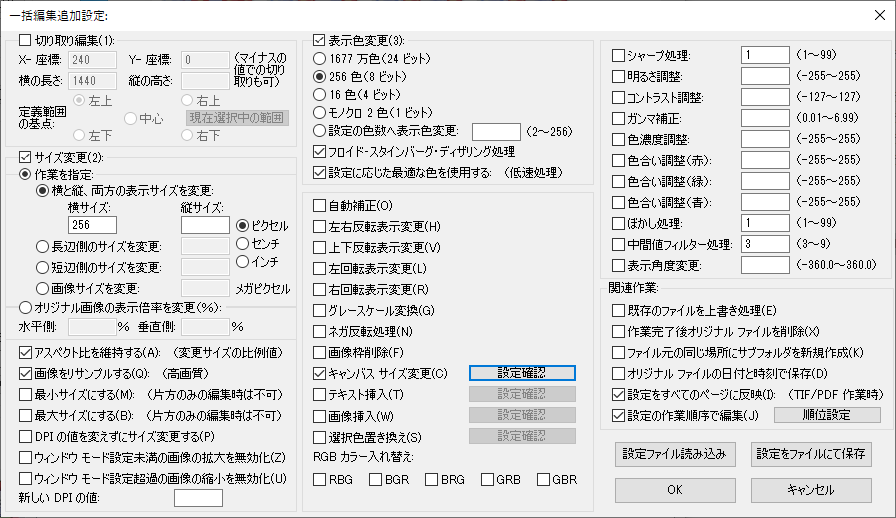 
------
「キャンバスサイズ変更」にチェックを入たら 
「設定確認」を押す
「Method1」の「Top side」「Bottom side」を広げる 
今回の例だと 256x192→256x256にサイズを変更するには、 
高さが足りてないので上下32ピクセルずつ増やす。 
「Canvas Color」は、黒にしておきましょう。 
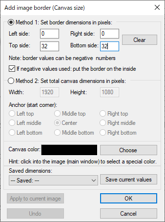 
---
「すべて追加」を押して「作業ファイルの数」に登録する。 
「並べ替え」を押して、「混成の名前」を選択し、ファイル名が１から順番に並ぶようにする。 
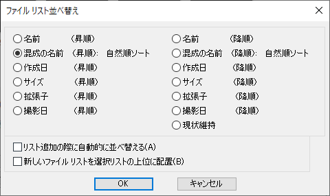 
---
「設定の作業順序で編集」にチェックを入れて「順位設定」を押す。
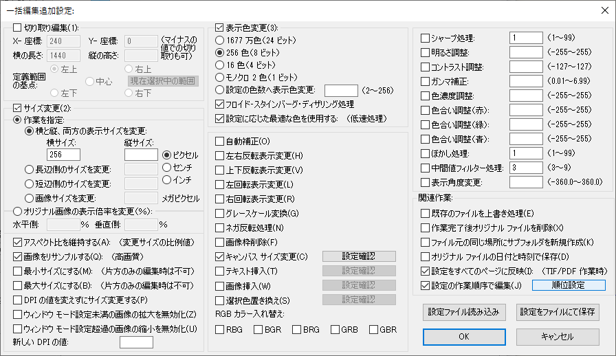 
「サイズ変更」→「キャンバスサイズ変更」→「表示色変更」の順に設定する。
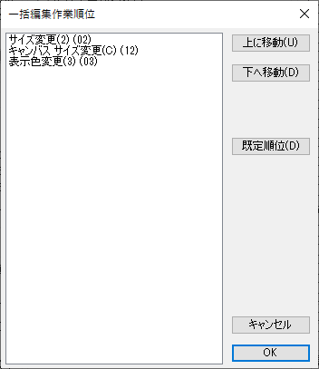 
---
全て設定できたら「実行」を押す。
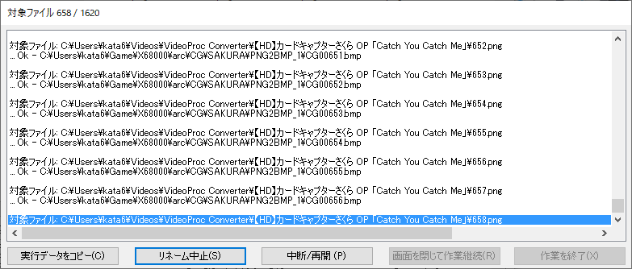 
---
アスペクト比が保持されたBMP画像ができる。 
 

---
### 6. MACSデータ作成補助ツール（MACScnv.x)を実行しよう！ 
X68000のエミュレータを起動して、変換したBMPが置いてあるパスに移動する。 
MACScnv.x、MACS_SCH.h、lze.exeをコピーしておく。 
変換で必要なツールは、バッチファイルのコマンドが実行できるようにPATH設定しておく。 
 
---
MACSデータ作成補助ツール（MACScnv.x)を実行する。 
下記の例だと 
＜第一引数 データのフォーマット選択＞ -s1なら256x256 256色のMACSデータを作る。 
＜第二引数 開始番号＞ 0ならCG00000が最初の画像になる。 
＜第三引数 増加値  ＞ 1ならCG00000、CG00001、CG00002、CG00003と+1ずつ処理する。 
＜第四引数 終了番号＞ 1943ならCG01943まで処理対象となる。 
＜第五引数 動画の再生時間 or 動画の音声の再生時間＞ ex. 1分21秒の動画なら81秒なので81と入力する。  
これにより、1621÷4＝全405枚の画像を使ったMACSデータができる。（1秒あたり5枚の画像）
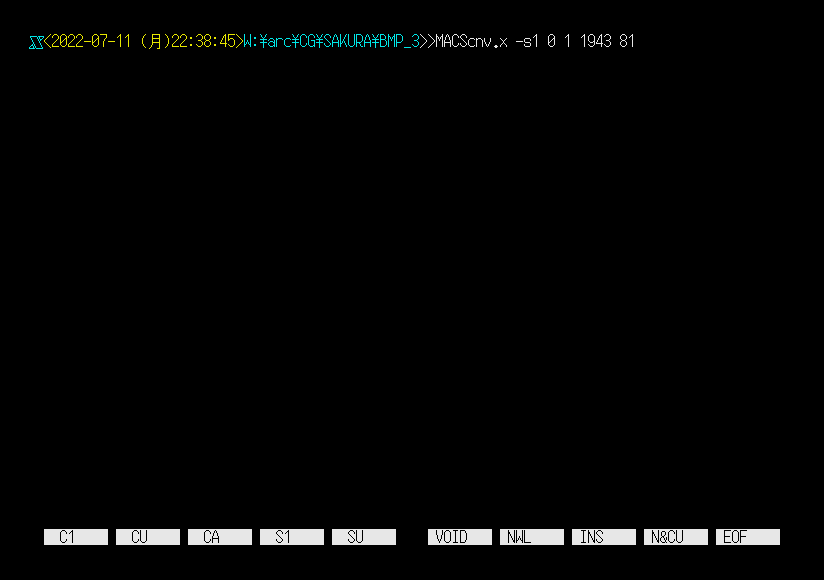 
バッチファイルとバイナリファイルリスト、アセンブラソースが作成される。 
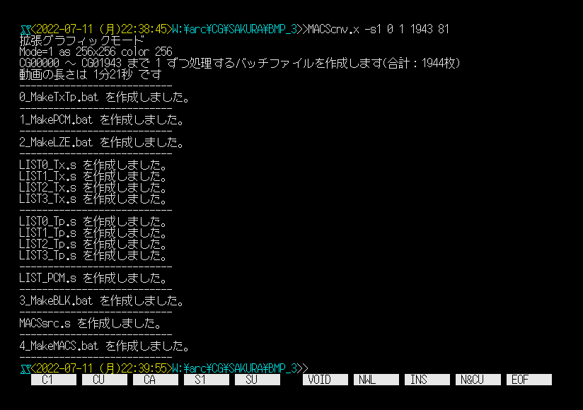 
MACSsrc.sをエディタで開いてTITLEとCOMMENTを編集しておく。
 
---
0_MakeTxTp.batを実行して、MACSデータに必要な画像を作る。
 
BMP画像を変換している様子（2000枚で40分ぐらい） 
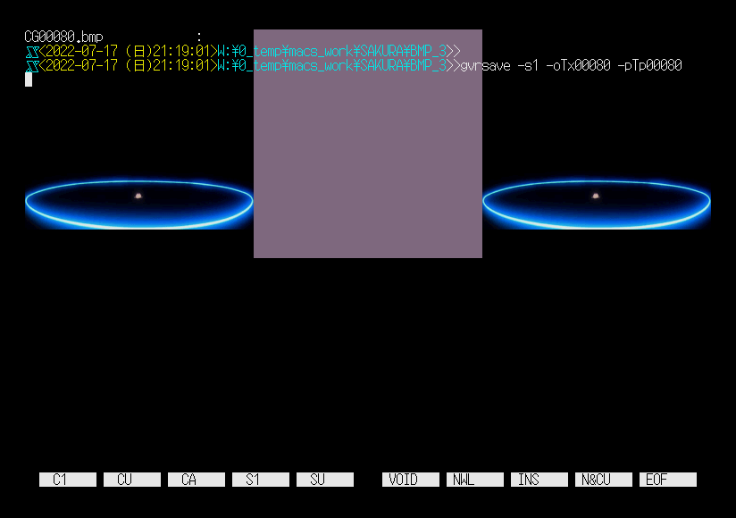 
---
1_MakePCM.batを実行して、WAVファイルをADPCMとまーきゅりーゆにっとのデータに変換する 
 
変換してる様子 
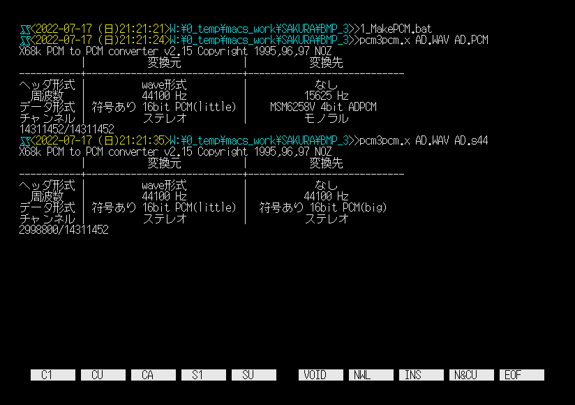 
---
2_MakeLZE.batを実行して画像を圧縮する。（ここだけWindowsのエクスプローラーから実行） 
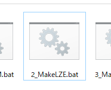 
こちらもそこそこ時間がかかるが、X68000で作業するよりも30倍ぐらい速い 
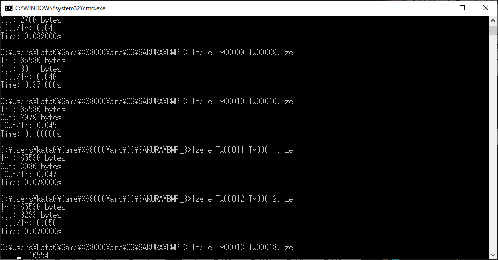 
---
3_MakeBLK.batを実行して変換されたデータをオブジェクトに変換する（現状、ここからはXEiJで作業することをオススメします） 
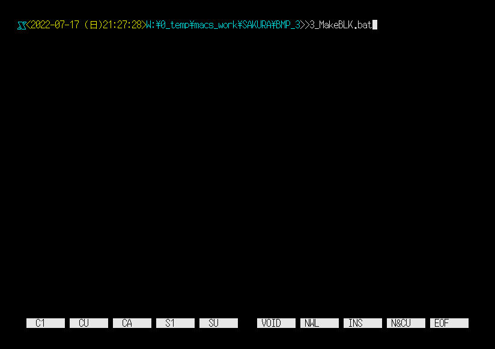 
変換している様子  
※テンポラリ設定をRAMディスク等に設定しているとサイズが足りないので-t <パス名>を追加して作業している 
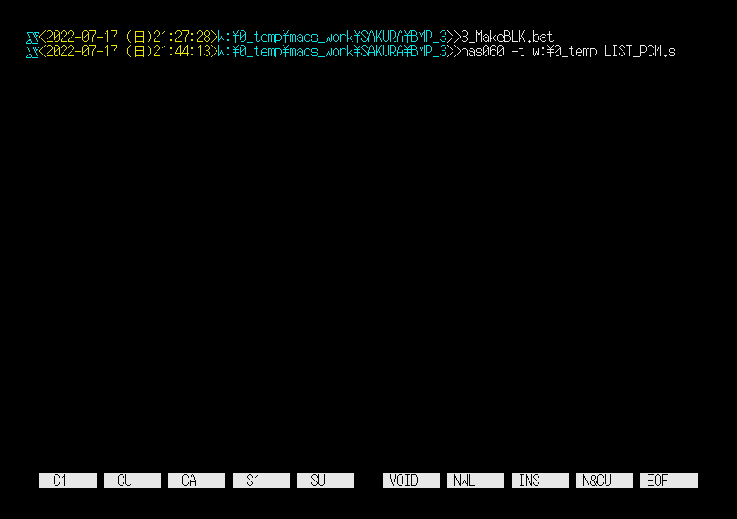 
---
4_MakeMACSを実行して、アセンブル、リンク(コンバート)、MACSデータ化を行う 
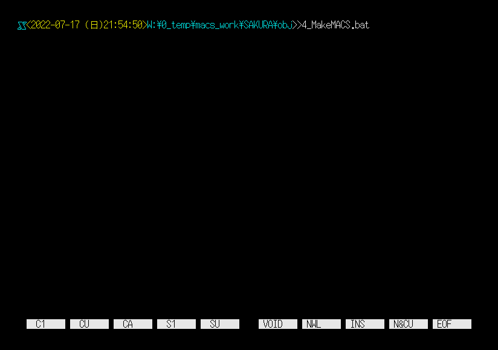 
MACSsrc.MCSファイルが作成される。  
※ファイル名（MACSsrc.MCS）は、適当にリネームしておくといいでしょう。 
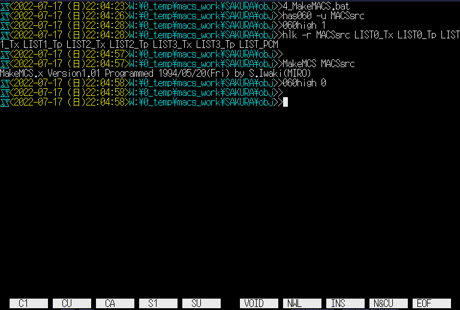 

---
### 6. 再生してみよう！ 
PCM8A.X もしくは、PCM8PP.Xを常駐させた後に、MACSDRV.Xを常駐する。 
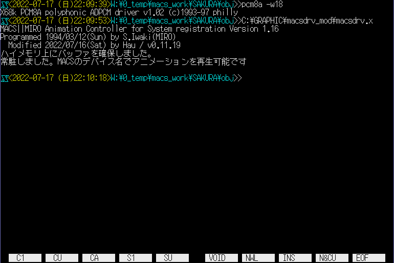 
\>MACSplay.x MACSsrc.MCS 
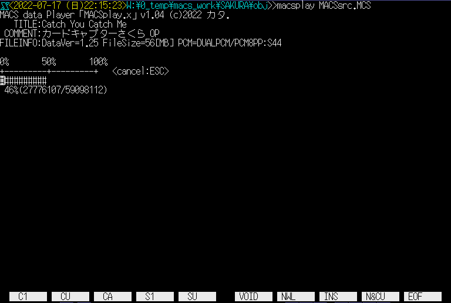 
動画が再生できたら完成です！ 
 
---
# おわり
